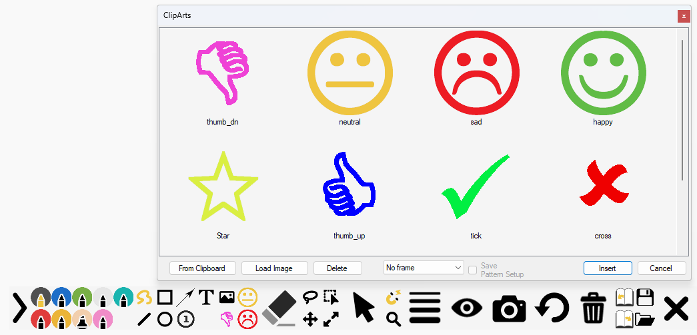

# Introduction

ppInk is a user-friendly on-screen annotation software for Windows, derived from gInk. 
It offers numerous new features inspired by Epic Pen, another screen annotation software, making it even easier to use. 

It offers numerous new features freely inspired from other application such as  Epic Pen, making it even easier to use. 
ppInk/gInk is designed with simplicity in mind, ensuring it doesn't distract presenters or audiences during presentations. Instead of adjusting individual settings like color, transparency, and tip width, ppInk allows you to select different pens for drawing, each with configurable attributes.

because of that ppInk can be used to annotate and then capture the screens, but it can also be used to support demonstration:

https://user-images.githubusercontent.com/4083478/119278023-16f58b00-bc23-11eb-95de-9dc16505bf43.mp4

(extract from @NOVAinc on Twitch) 
other demo : https://www.twitch.tv/novaaoe/clip/PlacidConcernedBulgogiOptimizePrime-mONUtlMLGvu2uUu1

This tool is intended to be usable through mouse,tablet pen(taking into pressure) but also throug touchscreen or graphic tablet, and keyboard can be used to activate functions.

It provides a variety of drawing tools, including hand writing, lines (2 points and polyline), rectangles, ellipses, arrows, numbering tags, left/right aligned text, cliparts, stroke patterns, and move/copy/resize/rotate functions.

To streamline the interface, some buttons have multiple functions that can be accessed through multiple clicks or long clicks (or right clicks). 

### Pens

Short click : select Pen  
Long Click / Right click : Open the pen parameters dialog

The pen setup (fading / width / line strokes) applies to the following  tools:
    
### Hand
  
  
### Rectangular
  

### Ellipsis
  

---
for these three drawing tools, clicks scroll through the following filling options:
<i>no filling  &rarr; colored (filled) area &rarr; outside filling (interior remains empty) &rarr; white filling &rarr; black filling</i>

---
        
### Line

  
  
- any click scroll through the following options:
 
<i> segment line &rarr; polyline &rarr; pen color filled polygon &rarr; outer filled polygon &rarr; colored border - white polygon &rarr; colored border - black  polygon</i>

### Numbering

  

  - successive Left click select the number tag stamp within the following options:
  
<i>transparent background &rarr; **modify** tag Number &rarr; white background &rarr; black background</i>
  - Right/Long click opens the dialog box to set the font/style used.

### Arrow

   
  * Left click on the button scrolls through the different arrow Tail/Heads:
  * Right/Long click on the tool button opens the dialog box to select or modify the arrow heads
 
As an alternative to Right/long click, the list of arrow heads can be modified through to the options/general settings  both opens the following dialog box:

Arrow heads are 300x201 px images and designed for an 18px wide line.  During drawing The images are resized to match the current pen size.

The arrow head images  reference point are aligned to the drawn segment ends.
This reference shall be defined on the center line of image(line 101) and shall be marked by a blue pixel (R=0, G=0, B=255). If this blue point does not exist, the center of the image is used.

By default, arrow heads are rotated to align with the line, but, if the arrow filenames starts with an exclamation mark (!), the drawing remains horizontal. eg.:

When drawing an arrow on screen, in standard: 
- left click/drag draws the arrow from the tail to the head
- right click/drag draws the arrow from the head to the tail.

this default behavior can be revert:
* using the right button in the sub-toolbar (if activated)
* through the setting in the global setting:

    as an alternative, you can select the arrow direction in the sub-toolbar 
<i> note: the arrow head can only selected by clicking on the button of the main toolbar</i>
  
### Text
  
Successive clicks select the  alignment:
<i>left-aligned &rarr; right-aligned</i>

  Once you will have selected the insert point a dialog box will allow you to type in the text and select properties:
  

  While typing in the text, 'enter' will jump to a new line, ctrl+enter terminates the input

### Lasso

Any click activates the selection of multiple strokes/drawings.
Once the tool select, left click adds elements to the selection, while right click removes them.
You can either :
   - circle strokes with the lasso (red/pink means add/remove)  or
   - click on strokes (highlighted by a dash box where hovered). 
  
Reselecting the tool will clear the selection.
Whe you modify the selection, you can use the undo button to cancel the latest modification.
When the measure option  is activated (eabled in the Options):
the individual length of the hovered drawing and the total length(if applicalbe) is reported in a tooltip.

if the drawing is a 2 segment polyline, the angle is also displayed

  

 Once you have selected some drawing, you can use
    * Erase tool :           will delete selected objects
    * move or copy tool :    will move/copy the selected objects
    * edit tool :            will modify color/line style/width of the selected strokes

### Move

Any click Scroll through the different tools:
<i>Move one or preselected drawing &rarr; Copy one or preselected drawing &rarr; Pan all drawings.</i>
    

### Edit

  - Left click : modify text/number tool (text and font) *or* the color/pen width of a stroke:
  

  - Right/Long click : edit the text default font(for the duration of the session only, go the Options for a sustainable modification)

  if some strokes are selected before short click, the pen/color dialog will open to modify all selected strokes at once.

### Resize / Rotate

  
Any click Scroll through the different tranformations:
  resize &rarr; rotate 
the selected stroke(s) (also applies to stroke under the cursor if no selection has been done first).

  Once select, to activate the transformation: 
  - (_the cursor displays a target shape_)
    select the center of the transformation. It can be :
    * a point which will be the center of the rotation of the resize
    * a drawing (highlighted with a red box) to use the 'center' of the stroke/shape
  - (_the cursor becomes a red big arrow_)
    click and drag to perform the scaling /rotation of the preselected (else the hovered) strokes.the selected (if applicable)
    the tranformation can be done many times
 
#### Demonstration of different tools:

https://user-images.githubusercontent.com/4083478/130367372-233d6d64-06fc-4f0f-a976-d66a621f36ac.mp4

* Pointer

* Left click : engage Pointer Mode
* Right/Long click : engage Window mode (Open a window) or click( to come back to fullscreen)

  **Pointer mode** keeps the drawings displayed but the cursor events will  be processed by the windows below.
  
  This mode can be engaged clicking on the pointer button on switching between applications with alt+tab

  **Window mode** allows you to define a window where ppInk will be active
  
  To come back to full desktop, engage window mode then just short click within the window

### Pen Width/Color Picker

* Short click : select Pen Width
* Long/Right click : engage **color picker**: this functions allow to modify the current pen color picking up a color on screen; in this mode mousewheel modifies transparency 

### Cliparts
Open the dialog to select image and the background/frame. This list displayed of cliparts is initialized from the list defined in the options. you can overload adding images for the inking sessions from files or from the clipboard.
You can then stamp the images. you just click, the image will be stamped with the images original size. if you use the right click the image will be centered on the cursor click

if you just draw a vertical or horizontal line, the image will be drawn with the drawn width/height respecting 
proportional size. else you can draw a box which will define the image size (non proportional). 
If you draw from bottom/right to up/left, the image will be stamped reversed.
    
3 preset cliparts are also available: they can be configured in the option dialogbox, or for the time of the session through a right or long click on the selected button.
    
**Animated Cliparts are  supported**: 
APNG and animaged-GIF are supported. By default animations are supported forever. you can specify duration or loops using square brackets: negative means the object will be destroyed at the end. x after the number means, the number indicated information in loop percent. eg:
       ppInkClipart.png -> animated for ever
       ppInkClipart[5.2].png -> animated for 5.2 sec and then animation stops
       ppInkClipart[-3.1].png -> animated for 3.1 sec and then disappear
       ppInkClipart[3.5x].png -> animated for 3 cycles and a half and then animation stops
       ppInkClipart[-2x].png -> animated for 2 cycles and then disappear

**Stroke of Patterns**:
This tools provides capability to draw images along a hand stroke.
The function is selected in the clipart dialog box throught the type of filling selection. Then you will be asked for the size of the image
dfdsfsf
https://user-images.githubusercontent.com/4083478/130367766-ee6cbd89-34d1-43ac-9f3e-13184b6a0bca.mp4

Note 1 : the checkbox "save Pattern setup" allows when you modify one of the predefined clipart to bypass the image size and interval in order to go directly to stroke drawing

### Snapshot
* Short click : Take a snapshot and exit after
* Long click : Take a snapshot and return to inking mode (keeping data); use alt+Hokey to do that with keyboard 
note that an option is available to invert behaviors between Long and short click

### Magnetic
The magnet activates some magnetic effect :
-   Find a point on the drawing next to the cursor. For rectangles, magnetic
    effect is available to vertices, and also to the middle of sides.(also activated pressing Ctrl)
-   The 8 points of the bounding rectangle of a text.(also activated pressing Ctrl)
-   On the line from the origin. The lines are horizontal,vertical and every 15°.(also activated pressing Shift)
The Magnetic distance can be adjusted in the options.
If only Ctrl or Shift is depressed, the global magnetic effect is switched off to only take into account the magnetic of the pressed key.
Hotkeys are availables for all tools,pens (configurable throught right click on icon next to clock)

 You can move one stroke when clicking first time on the button. The stroke to be moved/copied will be surrounded by a rectangle to identify it and gets its measurement
 When in Move one/Copy one or Erase, when the cursor flies over a shape, a tool tip indicates the length of the stroke. if the stroke is a 3 point polyline, it will also indicates the drawn angle.

### Zoom
Two zoom can be activated (multiple clicks on the zoom buttom). the first one offers a standard dynamic window following the cursor. with the second one, you select the area that you want to enlarge. this area will be frozen and then full displayed on the screen. You can then carry on drawing on this new enlarged background image. a new click will end working on this image and will show back the screen and will restore the previously drawn strokes.
 behind the zoom, a spot mode is also available where the screen is masked and a transparent area follows the cursor:
 
note 1: if the option is activated, you can activate the spot depressing alt.
note 2: the spot  remains active during pointer mode
note 3: color, transparency, spot size, and activation with alt can be adjusted in the options / general tab
 
### Clear Board:

short click : Delete all drawings and apply last selected background
Long click : Delete all drawings and select background surface color (white/black/customed color(modifiable through Options))
In options you will be able to select a default mode at opening , and customed color
advice : the created rectangle can be deleted using the erasor next to the border of the screen.

### Save / Load

through those two buttons, you will be able to store(in a text format) the current strokes. Load redraw the saved strokes onto the existing drawing.
- Save button  : a long click(or first short click) is a sort of "save as" : it open the dialog box and will allow you to select the filename. the following short clicks will overwrite the strokes into the previously named file.
note that a backup is done when inking is ended/quit.

Load button : a long click(or first short click) is a sort of "load as" : it open the dialog box and will allow you to select the filename. the following short clicks will load the strokes from the previously named file. at first click the file loaded is the autosave(from latest session).

An automatic save is performed when closing inking mode in autosave.strokes.txt . If you have ended your drawing session by error, you can recall your work depressing load button immediately after opening session.

## Other features / tricks

### Alt+ shortcut for temporary commands

When this option is activated (yes by default), when Alt is pressed and hold, the tool/pen/mode is temporary selected, left when alt is released
eg : with Hand drawing selected, press Alt and keep it  down. Press and release R : rectangle is active, as long as Alt is depressed, and Hand will be reengaged when Alt is released
This can be reset any combinaisons of Pens and Tools : eg : press Alt, you can engage Filled Blue rectangle, depressing R twice, and 3 (in any order), and return to previous tools/color releasing Alt
Alt also works with dash line selection or fading shortcut.
This can be also used with Erasor
when pressing down Alt, the cursor is also temporary change to the big arrow to ease finding it on screen.

### Option Capture at toolbar opening

Capture can be engaged as toolbar is opened. This option is set to false by default.

### Pens Options

through the options or long click on a pen button, or using the edit pen hotkey you can edit advance pen:
 
- Fading : the stroke drawn will disappear after the defined time(adjustable in options dialogbox/pen tab)
- Line Style (Stroke/Solid/Dash/Dot/DashDot/DashDotDot) : This will apply the define line style on all type of drawings. Stroke keeps the original drawing which uses the pen pressure to adjust the width. Solid,Dash,... ignore pen pressure. 

_Note1 :  When drawing with dashed lines,try to not draw too slowly : the number of vertex will increase and make the drawing not very nice_

_Note2 : Hotkeys allows to set/unset the fading, linestyle, increase/decrease penwidth and open the pen modify dialog of the current pen_

_Note3 : an option is now available in options/pen to allow to modify the linestyle when clicking on already selected pen button(or using hotkeys). also an option in hotkeys allow to select which linestyle will be accessible through click/hotkeys (not applicable to Pen Modify dialog box)_

A global option exists also to set/unset smoothing. When off, strokes drawing will not be smoothed. General recommendation is to leave this option on.

### cursor files
You can configure you own cursor file, saving it as cursor.ico in your exe folder (click position and size are loaded from the file). In the same you can save an image as FloatingCall.png to define the calling form image(in this case the width and transparency are in the Window_POS parameter in config.ini

### mouse wheel

Mouse wheel allows you mainly to modify the pen width. this can be easily observed with the tipped cursor. in this configuration, finding the mouse may be difficult to find in this configuration : you can then depress the alt key to get the arrow(or customized) cursor. When Number tool is selected, instead of change pen with, it changes the number size.
shift+mouse wheel allows to select pen
note1 : mouse wheel / shift+ mouse wheel can now be swapped (shift+mouse wheel to access pen width) : available in options / pen tab
note2 : as said above, two hotkeys are available to control width through the keyboard. 

### video recording

ppInk has now some capability to do some video recording. tuning is available in options/video tab :
   - basic recording with FFmpeg:
   You need to first install ffmpeg. and select the option in the video tab. In this case the button will be proposed. you can start/stop recording. Names and destination folders are defined throught the command line.
   - advanced recording with OBS-studio:
   You need to first install and configure OBS-studio(https://obsproject.com/fr/download) with OBS-websocket(https://github.com/Palakis/obs-websocket). select the required option (recording or broadcasting). with this program you will be able to start/stop broadcasting or start/pause/resume/stop video recording. file names and folders are defined in OBS-studio.
   Note : ppink is now compatible with release 4.8 of OBS-websocket. this should be fixed in very next release. for the moment,prefer to stop recording when stopping Ink mode

### UI customisation
You add arrow.ani/cur/ico and eraser.ani/cur/ico to put your own cursors. if you use ico file the cursor is down with the file sized ( you can then put a bigger or smaller image)
toolbar Background Color can be changed in the options. currently a draw hickup make the background color incorrect during opening. transparency is currenly ignored
Button Images can be customized putting Png files in the ppink exe folder. the name to be used are the same as the one from the src folder.
When checked in the options, a secondary toolbar will open when selected some tools to access all functions/filling immediately:

The example above shows also an example with the pens on two lines (setup through options dialog box)

### Toolbar orientation

You can now select how the toolbar will be deployed : to left/ to right or vertically to top/ to bottom

### Engaging Pointer with Alt+Tab 

When the option is set in the options, switching application (with alt+tab) will engage pointer mode. Also, 
Note that you can still fold toolbar when drawing without engaging pointer mode with the dock button.

### Measurement tool

When enabled, in Move one/Copy one or erase tool, the length of the selected object is provided in a tooltip.

The example shows also a very specific case where the object is a 3 point polyline, the angle is also computed.

### Window mode

You can now run ppink in window mode (engaged through Long/Right Click on pointer icon)
In this mode ppInk is run in a window and you can access clicks or mousewheel applications out of the window:

https://user-images.githubusercontent.com/4083478/112311221-c656c580-8ca5-11eb-895b-2279366c0fc4.mp4
  
<I>note : the border color can be changed directly in config.ini</I>

### snapshots in pointer mode

when trying to annote menu opened with mouse click / contextual menus

https://user-images.githubusercontent.com/61389799/111090958-1d3bfc80-853a-11eb-91fc-04e85ed18454.mp4

(demo from @eamayreh)

you can configure shortcuts with shift/ctrl/alt with a press and hold and tap twice keys to prevent menu to close
multiple snapshots can be captured, they are pasted one over the other, in the reverse order to make a full sequence

### Rest API

In order to allow customisation, ppInk provides now a REST API allowing control from an external program/device such as a streamdesk from Elgato or touchPortal:
Example with StreamDesk :

example with touchportal:

(thanks to @NOVAinc)

Ensure you are working with http protocol
All the API is described in the https://github.com/pubpub-zz/ppInk/raw/master/ppInk/httpRequests.md (provided next to ppink.exe in each release)

Note that this API returns results in JSON format that can be used for further extension.

### Download

<https://github.com/PubPub-zz/ppInk/releases/>

### Change log

<https://github.com/pubpub-zz/ppInk/blob/master/changelog.txt>

### How to use

Start ppInk.exe and an icon will appear in the system tray and possible a floating window(\*)
(which can be moved using RightClick) to start drawing on screen.  
Inking is started :
 - clicking on floating icon
 - clicking on the icon in the system tray
 - using the global shortcut (ctr+alt+G by default)
 - immediately after start Pping if "--startInking" (case insensitive) has been added tocommand line
 - ppInk is run once more (no extra instance is started)

(\*) activation and position saving are available in options.

Click the exit button or press ESC to exit drawing.

### Features

-   Compact and intuitive interface with customizable hotkeys.

-   Inks rendered on dynamic desktops.

-   Drawing tools: Hand Writing, Line, Rectangular, Ellipsis, Arrow, Numbering
    Tag, Text Left/Right aligned

-   Stylus with eraser, touch screen and mouse compatible.

-   Click-through mode. (note : once inking is engaged, global shortcut enters and exits this mode)

-   Multiple displays support.

-   Pen pressure support.

-   Snapshot support.

-   Hotkey support. (includes hotkeys with Del, BackSpace; in options **use ctrl+shift+del or ctrl+shift+backspace to delete the current hotkey**)

-   Magnetic effect when drawing shapes

-   Filled shapes

-   Video recording

-   Load/Save stroke

-   Zoom (2 versions)

### Tips

-   **There is a known issue for multiple displays of unmatched DPI settings (100%, 125%, 150%, etc.). If you use ppInk on a computer with multiple displays of unmatched DPI settings, or you encounter problems such as incorrect snapshot position, unable to drag toolbar to locations etc., please do the following as a workaround (in Windows 10 version 1903 as an example): right-click ppInk.exe, Properties, Compatibility, Change high DPI settings, Enable override high DPI scaling behavior scaling performed by: Application.**

-   There is a very few hidden options you can tweak in config.ini that are not shown in the options window.

### Configurations

-    ppInk can be largely configured. Some examples/proposals of simplified configuation are offered here:
  * [Simplified configuration from @earthjasonlin](extra_doc/simplified_from_earthjasonlin.md)
     

_note about ini files_: when upgrading to a newer version, you can copy your config.ini / pens.ini / hotkeys.ini. All the new entries will be copied from the defaults part of the delivery,
you can then change the new parameters and when you will use the `save to files` in the options dialog box, they will be appended to your files

### How to contribute to translations

gInk/ppInk supports multiple languages now (ppInk introduces a few new sentences where internationalization has not be implemented.). Here is how you can contribute translation. Simply create a duplication of the file "en-us.txt" in "bin/lang" folder, rename it and then translate the strings in the file. Check in ppInk to make sure your translation shows correctly, and then you can make a pull request or use https://github.com/pubpub-zz/ppInk/issues/17 to propose your translation.

When upgrading to a new version, to ease translation, all the missing entries in your translation can be copied from the english version into your translation : For this, go the option, (re-)select your current langage (or another one) in the langage list, you will be prompted for completing the langage definition file. if you say yes, all missing inputs (will be added with the english translation). You then just have to translation the new inputs.
after translation you can(not required) also reorder the sentences as you wish. 

gInk  
https://github.com/geovens/gInk  
https://github.com/geovens/gInk  
&copy; Weizhi Nai &copy; 2019

ppInk
https://github.com/pubpub-zz/ppInk
&copy; Pubpub-ZZ 2020-2024

